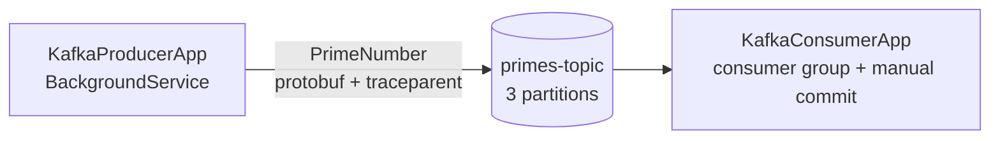

# .NET Kafka Pipeline

[](https://github.com/nicknad/Dotnet-Kafka-Setup/actions/workflows/ci.yml)

A small, production-shaped example of a Kafka producer/consumer pipeline built on modern .NET
(.NET 10, C# 14, Confluent.Kafka, Protobuf, OpenTelemetry, Serilog, Generic Host).

The producer generates primes below 10,000 and publishes protobuf-encoded `PrimeNumber` messages to
`primes-topic`. The consumer processes them in the `prime-consumer-group`, commits offsets manually
(at-least-once), and continues tracing the work using the trace context propagated through Kafka
message headers.

## What this demonstrates

- **Generic Host, dependency injection and typed options** with validation at startup
- **Configuration via `appsettings.json` + environment variables** (`Kafka__BootstrapServers`, ...)
- **Confluent.Kafka client configuration**: idempotent producer (`Acks.All`), manual consumer commits,
  rebalance handlers, tombstone handling
- **Protobuf contract in a shared library** generated once and referenced by both apps
- **Graceful shutdown**: `BackgroundService` + `CancellationToken`, producer flush on exit
- **Distributed tracing across the async boundary**: W3C `traceparent` injected into Kafka headers,
  extracted by the consumer as the parent activity; OTLP or console exporter
- **Structured logging** with Serilog message templates
- **KRaft-mode Kafka in Docker Compose** with healthcheck, explicit topic provisioning, and separate
  internal/external listeners so containers and host processes can both connect
- **Unit tests and CI** (GitHub Actions), central package management, pinned broker image

## Architecture



## Prerequisites

- [.NET SDK 10](https://dotnet.microsoft.com/download) (only needed for local runs/tests)
- [Docker](https://docs.docker.com/get-docker/) with Compose v2

## Quick start (everything in Docker)

```bash
git clone https://github.com/nicknad/Dotnet-Kafka-Setup
cd Dotnet-Kafka-Setup
docker compose up --build
```

Compose starts the broker, waits for its healthcheck, creates `primes-topic` if needed, then starts
the consumer and producer. The producer publishes for roughly 100 seconds and exits; the consumer
keeps running.

## Running the apps locally

Start just the broker and topic provisioning, then run the apps from your IDE or CLI. The apps read
`localhost:9092`, which maps to the broker's external listener.

```bash
docker compose up -d kafka kafka-init

dotnet run --project src/KafkaConsumerApp
dotnet run --project src/KafkaProducerApp
```

## Configuration

| Key | Default | Description |
| --- | --- | --- |
| `Kafka:BootstrapServers` | `localhost:9092` | Broker endpoint (comma-separated list supported) |
| `Kafka:Topic` | `primes-topic` | Topic produced to / consumed from |
| `Kafka:ConsumerGroup` | `prime-consumer-group` | Consumer group (consumer only) |
| `Otlp:Endpoint` | *(empty)* | If set, traces are exported via OTLP; otherwise the console exporter is used |

Any setting can be overridden with environment variables using the standard .NET convention,
e.g. `Kafka__BootstrapServers=kafka:29092`. Options are validated on startup.

## Project layout

```
src/KafkaPipeline.Core       protobuf contract, serializers, options, tracing helpers
src/KafkaProducerApp         producer worker + configuration
src/KafkaConsumerApp         consumer worker + configuration
tests/KafkaPipeline.Tests    unit tests for prime logic, serialization and trace propagation
compose.yaml                 single-node KRaft Kafka, topic init, both apps
```

## Tests

```bash
dotnet test KafkaPipeline.slnx
```

The GitHub Actions workflow restores, builds and tests the solution on every push and pull request.

## Design decisions

- **Raw Confluent.Kafka instead of a framework** (MassTransit/Wolverine): this example stays close to
  the protocol so producer/consumer configuration is explicit and visible.
- **At-least-once delivery**: offsets are committed after processing; duplicates are possible if the
  process dies before a commit, so consumers must be idempotent.
- **No schema registry**: the protobuf contract is compiled into a shared library. In production,
  pairing Protobuf with a schema registry (and a magic-byte framing convention) makes schema
  evolution safe across independent deployments.
- **Separate listeners**: `INTERNAL://kafka:29092` for containers, `EXTERNAL://localhost:9092` for
  host processes — the same broker serves both without editing code.
- **Trace context in headers**: W3C `traceparent` is injected/extracted manually, keeping the
  pipeline traceable end to end without a broker plugin.

## Possible next steps

- Integration tests with [Testcontainers for .NET](https://dotnet.testcontainers.org/)
- Dead-letter topic and retry policy for poison messages
- OTLP collector + dashboards in Compose
- Schema registry with Protobuf and schema-evolution tests

## Third-party licenses

See [THIRD-PARTY-LICENSES.md](THIRD-PARTY-LICENSES.md).
