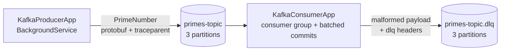

# .NET Kafka Pipeline

[](https://github.com/nicknad/Dotnet-Kafka-Setup/actions/workflows/ci.yml)

A small, production-shaped example of a Kafka producer/consumer pipeline built on modern .NET
(.NET 10, C# 14, Confluent.Kafka, Protobuf, OpenTelemetry, Serilog, Generic Host).

The producer generates primes below 10,000 and publishes protobuf-encoded `PrimeNumber` messages to
`primes-topic`. The consumer processes them in the `prime-consumer-group`, commits offsets manually in
batches (at-least-once), forwards malformed payloads to a dead-letter topic, and continues tracing the
work using the trace context propagated through Kafka message headers.

## What this demonstrates

- **Generic Host, dependency injection and typed options** with validation at startup
- **Configuration via `appsettings.json` + environment variables** (`Kafka__BootstrapServers`, ...)
- **Confluent.Kafka client configuration**: idempotent producer (`Acks.All`), manual consumer commits
  batched by count/interval (plus on shutdown and rebalance), rebalance handlers, tombstone handling
- **Poison-message handling**: the consumer reads raw bytes, parses Protobuf explicitly, and forwards
  malformed payloads (original bytes + headers + failure metadata) to a dead-letter topic instead of
  crashing
- **Protobuf contract in a shared library** generated once and referenced by both apps
- **Graceful shutdown**: `BackgroundService` + `CancellationToken`, producer flush on exit
- **Distributed tracing across the async boundary**: W3C `traceparent` injected into Kafka headers,
  extracted by the consumer as the parent activity; OTLP or console exporter
- **Structured logging** with Serilog message templates
- **KRaft-mode Kafka in Docker Compose** with healthcheck, explicit topic provisioning, and separate
  internal/external listeners so containers and host processes can both connect
- **Unit tests and CI** (GitHub Actions), central package management, pinned broker image
- **Supply-chain checks**: NuGet audit with high/critical advisories as errors, PackageGuard license
  and package policy, CycloneDX SBOM published by CI

## Architecture



## Prerequisites

- [.NET SDK 10](https://dotnet.microsoft.com/download) (only needed for local runs/tests)
- [Docker](https://docs.docker.com/get-docker/) with Compose v2

## Quick start (everything in Docker)

```bash
git clone https://github.com/nicknad/Dotnet-Kafka-Setup
cd Dotnet-Kafka-Setup
docker compose up --build
```

Compose starts the broker, waits for its healthcheck, creates `primes-topic` and `primes-topic.dlq`
if needed, then starts the consumer and producer. The producer publishes for roughly 100 seconds and
exits; the consumer keeps running (and is restarted by Compose if it ever stops unexpectedly).

## Running the apps locally

Start just the broker and topic provisioning, then run the apps from your IDE or CLI. The apps read
`localhost:9092`, which maps to the broker's external listener.

```bash
docker compose up -d kafka kafka-init

dotnet run --project src/KafkaConsumerApp
dotnet run --project src/KafkaProducerApp
```

## Configuration

| Key | Default | Description |
| --- | --- | --- |
| `Kafka:BootstrapServers` | `localhost:9092` | Broker endpoint (comma-separated list supported) |
| `Kafka:Topic` | `primes-topic` | Topic produced to / consumed from |
| `Kafka:ConsumerGroup` | `prime-consumer-group` | Consumer group (consumer only) |
| `Kafka:DeadLetterTopic` | `<Topic>.dlq` | Override for the dead-letter topic (consumer only) |
| `Kafka:CommitBatchSize` | `100` | Commit offsets after this many handled messages (consumer only) |
| `Kafka:CommitInterval` | `00:00:05` | ...or after this long, whichever comes first (consumer only) |
| `Otlp:Endpoint` | *(empty)* | If set, traces are exported via OTLP; otherwise the console exporter is used |

Any setting can be overridden with environment variables using the standard .NET convention,
e.g. `Kafka__BootstrapServers=kafka:29092`. Options are validated on startup.

## Project layout

```
src/KafkaPipeline.Core       protobuf contract, serializer/parser, options, tracing and hosting helpers
src/KafkaProducerApp         producer worker + configuration
src/KafkaConsumerApp         consumer worker + configuration
src/Dockerfile               one parameterized image build for both apps (`--build-arg APP=...`)
tests/KafkaPipeline.Tests    unit tests for prime logic, serialization and trace propagation
compose.yaml                 single-node KRaft Kafka, topic init, both apps
```

## Tests

```bash
dotnet test KafkaPipeline.slnx
```

The GitHub Actions workflow restores, builds and tests the solution on every push and pull request.

## Supply-chain policy

Dependency policy is enforced mechanically instead of reviewed after the fact:

- **Vulnerabilities** — `NuGetAudit` runs on every restore across direct and transitive packages.
  [`Directory.Build.props`](Directory.Build.props) sets the audit level to `moderate` and turns
  high (`NU1903`) and critical (`NU1904`) advisories into errors, so a restore/build fails instead of
  shipping a known-vulnerable dependency.
- **Licenses and banned packages** — [PackageGuard](https://packageguard.org/) enforces the allow/deny
  lists in [`packageguard.config.json`](packageguard.config.json). The tool is pinned in
  [`.config/dotnet-tools.json`](.config/dotnet-tools.json), so the same version runs locally and in CI.
- **SBOM** — CI emits a CycloneDX SBOM for the resolved dependency graph and uploads it as a build
  artifact.

```bash
dotnet restore KafkaPipeline.slnx                # vulnerability audit runs automatically
dotnet package list --project KafkaPipeline.slnx --vulnerable --include-transitive
dotnet tool restore
dotnet tool run packageguard -- KafkaPipeline.slnx --skip-restore \
  --sbom cyclonedx --sbom-output artifacts/sbom.cyclonedx.json
```

To allow a new license or pin a package version, update `packageguard.config.json`. To accept a
specific advisory temporarily, suppress it with `NoWarn` and a comment explaining why.

## Design decisions

- **Raw Confluent.Kafka instead of a framework** (MassTransit/Wolverine): this example stays close to
  the protocol so producer/consumer configuration is explicit and visible.
- **At-least-once delivery**: offsets are committed after processing — every `CommitBatchSize` handled
  messages or `CommitInterval`, whichever comes first, and always on shutdown and partition revocation.
  Duplicates are possible if the process dies before a commit, so consumers must be idempotent.
- **Dead-letter instead of crashing**: the consumer consumes raw bytes and parses Protobuf explicitly,
  because a typed deserializer throws inside `Consume` before a result exists — no payload, offset or
  headers to act on. A malformed payload is forwarded with its original bytes, original headers
  (including `traceparent`) and `dlq.*` metadata headers to `Kafka:DeadLetterTopic`, and its offset is
  committed only after that write succeeds; if the write fails, the worker stops rather than skip the
  message. Retry topics with backoff are out of scope — parse failures are permanent.
- **No schema registry**: the protobuf contract is compiled into a shared library. In production,
  pairing Protobuf with a schema registry (and a magic-byte framing convention) makes schema
  evolution safe across independent deployments.
- **Separate listeners**: `INTERNAL://kafka:29092` for containers, `EXTERNAL://localhost:9092` for
  host processes — the same broker serves both without editing code.
- **Trace context in headers**: W3C `traceparent` is injected/extracted manually, keeping the
  pipeline traceable end to end without a broker plugin.

## Third-party licenses

Every dependency and its license are listed in the CycloneDX SBOM that CI generates on each build
(see [Supply-chain policy](#supply-chain-policy)), and PackageGuard fails the build on any license
outside the allow list in [`packageguard.config.json`](packageguard.config.json).
