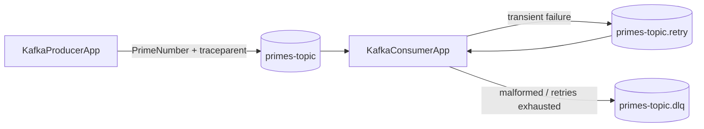

# .NET Kafka Pipeline

[](https://github.com/nicknad/Dotnet-Kafka-Setup/actions/workflows/ci.yml)

A production-shaped Kafka pipeline on .NET 11 (C# 15, Confluent.Kafka, Protobuf, OpenTelemetry,
Serilog, Generic Host). The producer publishes protobuf-encoded primes below 10,000 to `primes-topic`;
the consumer processes them with batched manual commits, durable idempotency, retry-with-backoff,
dead-lettering, and trace/metric export.

## Features

- Typed options validated at startup; configuration via `appsettings.json` or `Kafka__*` env vars
- Idempotent producer (`Acks.All`); manual commits batched by count/interval and on rebalance/shutdown,
  covering every assigned partition
- At-least-once processing: offsets commit after handling; redeliveries are absorbed by a **RocksDB
  idempotency store** (in-memory store available for tests and short-lived tools)
- Poison handling: malformed payloads dead-letter immediately with original bytes, headers and `dlq.*`
  metadata; transient failures retry on `<topic>.retry` with exponential backoff (capped at 30s) and
  dead-letter once attempts are exhausted
- Versioned protobuf envelope (`schema.version`, `content.type` headers); a missing version means v1;
  `ISchemaVersionProvider` is the seam for a real schema registry
- W3C `traceparent` spans across the async boundary; metrics for produce/consume/commit/DLQ plus a
  consumer-lag gauge from librdkafka statistics (OTLP or console exporters)
- KRaft Kafka in Docker Compose: healthcheck, explicit topic provisioning, internal/external listeners

## Architecture


```mermaid
flowchart LR
    P[KafkaProducerApp] -->|PrimeNumber + traceparent| T[(primes-topic)]
    T --> C[KafkaConsumerApp]
    C -->|transient failure| R[(primes-topic.retry)]
    R --> C
    C -->|malformed / retries exhausted| DL[(primes-topic.dlq)]
```

## Prerequisites

- [.NET SDK 11](https://dotnet.microsoft.com/download) (local runs/tests; pinned in `global.json`)
- [Docker](https://docs.docker.com/get-docker/) with Compose v2

## Quick start

```bash
docker compose up --build
```

Compose starts the broker, waits for its healthcheck, creates the topics, then starts the consumer and
producer. The producer exits once it has published all primes; the consumer keeps running.

Run locally instead:

```bash
docker compose up -d kafka kafka-init
dotnet run --project src/KafkaConsumerApp
dotnet run --project src/KafkaProducerApp
```

## Configuration

| Key | Default | Description |
| --- | --- | --- |
| `Kafka:BootstrapServers` | `localhost:9092` | Broker endpoint (comma-separated list supported) |
| `Kafka:Topic` | `primes-topic` | Topic produced to / consumed from |
| `Kafka:ConsumerGroup` | `prime-consumer-group` | Consumer group (consumer only) |
| `Kafka:DeadLetterTopic` | `<Topic>.dlq` | Dead-letter topic (consumer only) |
| `Kafka:RetryTopic` | `<Topic>.retry` | Retry topic for transient failures (consumer only) |
| `Kafka:MaxRetryAttempts` | `3` | Retries before dead-lettering (consumer only) |
| `Kafka:RetryBackoffMs` | `1000` | Base backoff, doubling per attempt and capped at 30s (consumer only) |
| `Kafka:CommitBatchSize` | `100` | Commit after this many handled messages (consumer only) |
| `Kafka:CommitInterval` | `00:00:05` | ...or after this long, whichever comes first (consumer only) |
| `Kafka:IdempotencyStore` | `RocksDb` | `RocksDb` (durable) or `InMemory` (process-local) (consumer only) |
| `Kafka:IdempotencyStorePath` | temp dir | RocksDB directory; mount a volume to survive restarts (consumer only) |
| `Kafka:IdempotencyMaxEntries` | `100000` | Dedup keys retained before oldest-first trimming (consumer only) |
| `Otlp:Endpoint` | *(empty)* | If set, traces and metrics export via OTLP; console exporter otherwise |

Any setting can be overridden with environment variables, e.g. `Kafka__BootstrapServers=kafka:29092`.

## Project layout

```
src/KafkaPipeline.Core               contract, messaging, observability, hosting helpers
src/KafkaProducerApp                 producer worker
src/KafkaConsumerApp                 consumer worker (idempotency, retry, DLQ)
tests/KafkaPipeline.Tests            unit tests
tests/KafkaPipeline.IntegrationTests broker-backed tests (Windows/WSL Containers, CI only)
src/Dockerfile                       one parameterized image build for both apps (--build-arg APP=...)
compose.yaml                         KRaft Kafka, topic init, both apps
```

## Tests

```bash
dotnet test KafkaPipeline.slnx
```

Unit tests cover prime logic, commit tracking, idempotency stores, retry policy, schema versioning,
trace context and metrics. `tests/KafkaPipeline.IntegrationTests` runs the consumer against a real
broker via [Wslc.Testcontainers](https://github.com/nicknad/Wslc.Testcontainers) in the GitHub Actions
Windows job (`.github/workflows/integration.yml`, `WSLC_RUN_INTEGRATION=1`); on Linux the project is
inert and its tests are skipped.

## Design decisions

- **At-least-once with durable dedup**: offsets commit after handling; duplicates are skipped via a
  RocksDB store keyed by topic-partition-offset, so a crash before commit does not reprocess on
  restart. The in-memory store only deduplicates within one process.
- **Retry, then dead-letter**: parse failures are permanent and go straight to `<topic>.dlq`;
  processing exceptions retry with backoff and dead-letter after `Kafka:MaxRetryAttempts`. If a DLQ or
  retry produce fails, the worker stops rather than skipping the message.
- **Schema versioning without a registry**: the payload stays pure protobuf; the version travels in
  headers; unknown versions are dead-lettered for an upgrade.
- **Raw Confluent.Kafka** instead of a framework: producer and consumer configuration stays explicit.
- **Separate listeners**: `INTERNAL://kafka:29092` for containers, `EXTERNAL://localhost:9092` for host
  processes — the same broker serves both without code changes.
- **Trace context in headers**: W3C `traceparent` is injected/extracted manually, keeping the pipeline
  traceable end to end without a broker plugin.

## .NET 11 notes

The solution targets `net11.0` (C# 15) and the container images are the .NET 11 runtime/SDK. The SDK
is pinned in [`global.json`](global.json) and CI builds and tests on `11.0.x`.

- **Worker failures now fail fast**: an exception escaping `BackgroundService.ExecuteAsync()` stops the
  host instead of being swallowed, so an unrecoverable Kafka or dead-letter produce error exits
  non-zero and Compose restarts the consumer. Both workers log the failure at critical level before the
  exception surfaces, which keeps the "stop rather than skip the message" guarantee visible.
- **CPU baseline**: .NET 11 requires x86-64-v2 (SSE3/SSSE3/SSE4.1/SSE4.2, POPCNT, CMPXCHG16B) on
  x86/x64 and LSE on Windows Arm64. Any CPU from roughly 2013 onward qualifies; older hosts print
  "The current CPU is missing one or more of the baseline instruction sets."
- **ReadyToRun moved to x86-64-v3** on Windows and Linux, so R2R-published builds start faster on AVX2
  hardware and fall back to JIT on older supported CPUs.

The remaining .NET 11 breaking changes were reviewed and do not apply here: no compression/TAR/ZIP,
named pipes, DSA, EF Core, Microsoft.Data.SqlClient, ASP.NET Core, or NativeAOT usage.

## Supply chain

`NuGetAudit` fails the build on high/critical advisories; [PackageGuard](https://packageguard.org/)
enforces the license/package policy in [`packageguard.config.json`](packageguard.config.json); CI
publishes a CycloneDX SBOM. All three run in the ubuntu CI job:
[`ci.yml`](.github/workflows/ci.yml).
